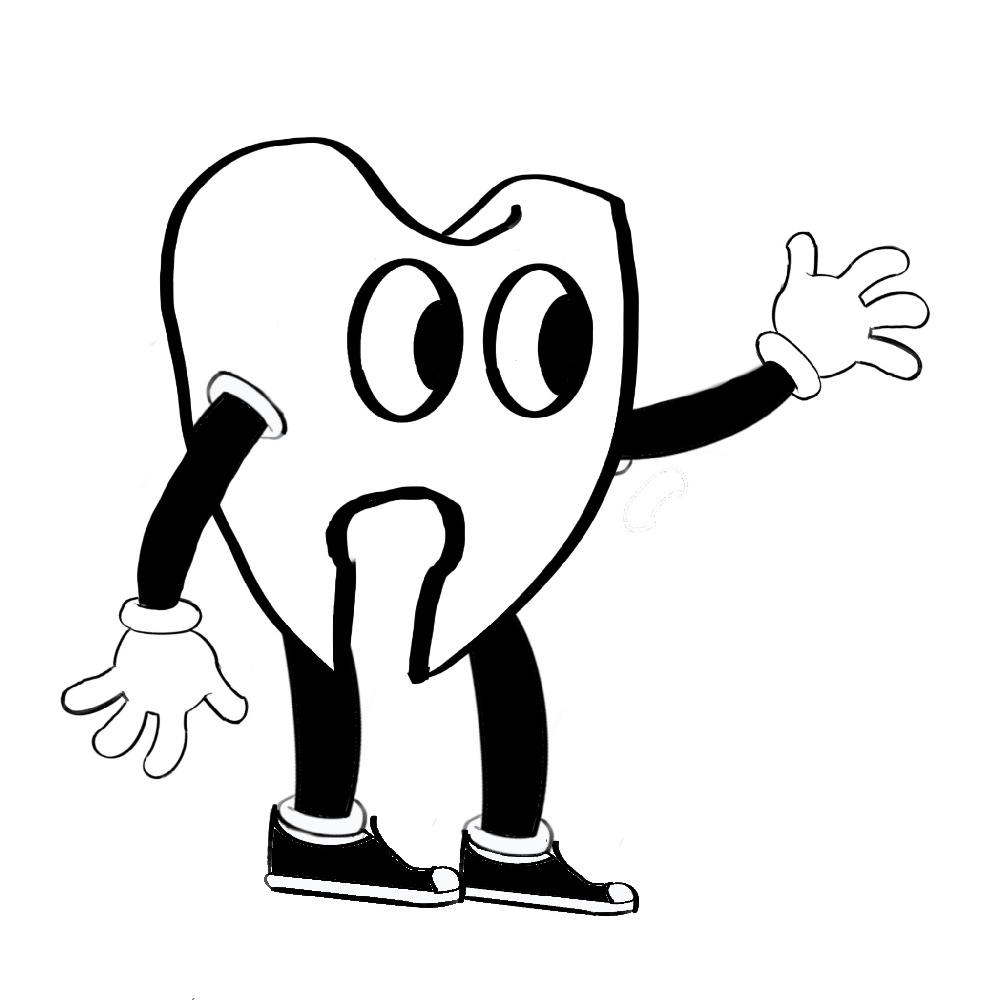

## App Info

**Tentative Title**: Abrasion.

**Type**: Video Game.

**Available on**: Mobile, Console, Desktop.

**Development Start**: 01.06.2022

---

## Pitch

In this game users will take on the role of _Dens_ a tooth trying to get back to his mouth after having to be removed due to eating too many sweets and cakes. On his way home he patches himself up with fillings and toothpaste while fighting his way through the minions of various sweet treat manufacturers utilising his trusty toothbrush and swinging from platform to platform with his floss hooked into dentist scalpels.

**Target Audience**:

- Gamers of all ages.

---

## Concept Sketch

---

## Features

- Tight, skill rewarding platform controls.
- Large, open interconnected map with gated areas.
- Fast paced quick combat.
- Visual animations and sprite changes.
- Clean readable user interface.
- 4-6 Zones: Grass, Water, Cave, Ice, Lava and Solar.
- Bonus reverse time travel zone with noir theme.

---

## Accessibility

- Assist settings to slow down, enable extra dashes and jumps so that people who are less into platform games can play.

---

## Timeline

|     | Milestone                          | Date            | Done |
| --- | ---------------------------------- | --------------- | ---- |
| 1   | [Tight Controls](Tight%20Controls) | 02.06.22        |  ✅   |
| 2   | [User Interface](User%20Interface) | 05.06.22        | Designed     |
| 3   | [Combat](Combat)                   | 06.06.22        |      |
| 4   | [Map Outline](Map%20Outline)       | 08.08.22        |      |
| 5   | [Art Assets](Art%20Assets)         | 12.08.22        |      |
| 6   | [Animation](Animation)             | 14.08.22        |      |
| 7   | [Sound Effects](Sound%20Effects)   | 18.08.22        |      |
| 8   | [Soundtrack](Soundtrack)           | 31.08.22        |      |
| 9  | [Polishing](Polishing)             | Release         |      |
| 10  | [Funding](Funding)                 | Release         |      |
| 11  | [Publish](Publish)                 | Estimate: 31.09 |      |

---

## Backlog Features

To be completed if I find time, or if funding goes well and people want these features. Possible to add as a future release.

- [ ] Floss Grapple
- [ ] 2 Extra playable characters. Incy and Cane.
- [ ] Mobile release.

---

## External Links

### Sources

[Brackeys](https://brackeys.com)

[Press Start](https://pressstart.vip)

[Tarodev](https://www.youtube.com/c/Tarodev/about)

[Jonas Tryoller](https://www.youtube.com/c/JonasTyroller)

[Thomas Brush](https://www.youtube.com/watch?v=LAzaateh9q4&list=WL&index=15&t=2s)

[Noodle](https://www.youtube.com/watch?v=yLd5wmBNCBM)

### Inspirations

[Celeste for Movement](http://www.celestegame.com)

[Hollow Knight for Combat](https://www.hollowknight.com)

[Cuphead for Art-style](http://www.cupheadgame.com)

